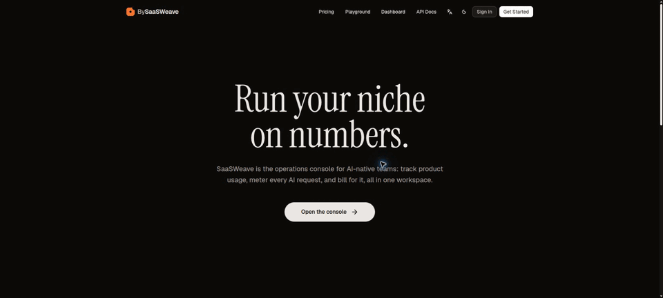

# SaaSWeave

SaaSWeave is a production-oriented, multi-tenant SaaS starter built as a full-stack TypeScript
monorepo. It combines TanStack Start, Hono, oRPC, Drizzle ORM, Better Auth, BullMQ, Redis, and
Paraglide.js behind one typed application boundary.

The repository is intended for teams building a hosted product with workspaces, billing,
background processing, administration, and operational controls already connected. The internal
workspace packages use the `@saasweave/*` scope consistently across apps, libraries, and tooling.

## Product tour



The slideshow covers the public experience, onboarding, workspace console, gated integrations,
platform administration, and operational tooling. See the
[complete product tour](docs/PRODUCT-TOUR.md) for detailed screenshots and active demonstrations of
batch processing, webhook configuration, email previews, administration controls, and the API
reference.

## What is included

- Workspace tenancy with member roles, invitations, profiles, and organization switching
- Email/password authentication, OAuth provider discovery, 2FA, SSO/SAML, sessions, and
  impersonation policy
- Workspace console for billing, usage, API keys, webhooks, notifications, audit history, exports,
  and security settings
- Platform administration for users, workspaces, plans, feature rollout, analytics, email,
  maintenance mode, and audit events
- Stripe checkout, portal, webhook ordering, subscriptions, usage attribution, and MRR snapshots
- BullMQ workers for email, notifications, webhooks, Stripe, data exports, batch jobs, and schedules
- PostgreSQL persistence through Drizzle schema and checked-in migrations
- Redis-backed cache, rate limits, queues, readiness, and queue metrics
- S3-compatible media storage through MinIO, a local-disk fallback, and optional imgproxy delivery
- Paraglide localization, SEO helpers, sitemap generation, transactional email templates, and a
  shared UI package
- Structured logs, Prometheus metrics, health probes, retention jobs, and backup verification tools

Most integrations are environment-gated. Stripe, OAuth, external email delivery, OpenAPI docs,
metrics, and the local SAML identity provider remain off until configured.

## Stack

| Area         | Technology                                                        |
| ------------ | ----------------------------------------------------------------- |
| Web          | React 19, TanStack Start and Router, TanStack Query, Tailwind CSS |
| API          | Hono, oRPC, OpenAPI                                               |
| Auth         | Better Auth, organization, 2FA, SSO, OAuth                        |
| Data         | PostgreSQL 18, Drizzle ORM                                        |
| Async        | Redis 8, BullMQ                                                   |
| Storage      | MinIO/S3-compatible storage, local disk, imgproxy                 |
| Localization | Paraglide.js                                                      |
| Tooling      | Vite Plus, pnpm workspaces, Vitest, Playwright, Oxfmt, Oxlint     |
| Deployment   | Multi-stage Docker images, Docker Compose, Coolify Compose        |

## Architecture

Three runnable applications sit above layered workspace packages:

```text
apps/web       TanStack Start SSR application and browser UI
apps/server    Hono HTTP process, auth, oRPC transport, webhooks, media
apps/worker    BullMQ process host, schedules, readiness and metrics

packages/core          framework-light contracts and security primitives
packages/env           validated server and browser environment schemas
packages/db            schema, migrations and persistence queries
packages/app           worker-safe application services
packages/jobs          queue producers, processors and schedules
packages/auth          Better Auth configuration and policies
packages/api           oRPC procedures and typed clients
packages/cache         Redis cache and rate limiting
packages/logger        structured request and ingestion logging
packages/observability metrics and tracing helpers
packages/mailer        transactional email rendering and delivery
packages/i18n          messages and localized routing helpers
packages/ui            shared UI primitives and theme tokens
packages/seo           route metadata helpers
```

Browser modules use the browser or isomorphic oRPC client exports. Database, server environment,
and privileged auth modules stay outside browser bundles. See
[the package dependency graph](docs/PACKAGE-DEPENDENCY-GRAPH.md) for the enforced direction of
dependencies.

## Quick start with Docker

### Prerequisites

- Docker with Compose v2
- Node.js `24.18.0` for repository utilities
- pnpm `11.3.0`

```bash
corepack enable
pnpm install --frozen-lockfile
cp .env.docker.example .env.docker
pnpm run auth:secret
```

Put the generated value in `BETTER_AUTH_SECRET` inside `.env.docker`, then start the stack:

```bash
pnpm run docker:up:build
```

| Service             | Local address                                 |
| ------------------- | --------------------------------------------- |
| Web                 | http://localhost:3000                         |
| API                 | http://localhost:5000/server                  |
| MinIO API / console | http://localhost:9000 / http://localhost:9001 |
| imgproxy            | http://localhost:8080                         |
| PostgreSQL          | `localhost:5432`                              |
| Redis               | `localhost:6379`                              |
| Worker health       | http://localhost:9100/health/ready            |

The one-shot `migrate` service applies migrations before the server and worker start. The default
stack logs transactional email to the console and runs billing in sample mode until providers are
configured. See [the local stack guide](docs/LOCAL-STACK.md) for SAML testing, health endpoints, and
troubleshooting.

Stop the stack without deleting named data volumes:

```bash
pnpm run docker:down
```

## Native development

Copy the native environment template, set a local database URL and auth secret, and start the
infrastructure you need:

```bash
cp packages/env/.env.example packages/env/.env
pnpm run auth:secret
pnpm run db:dev:start
pnpm run db:migrate
pnpm run dev
```

Vite Plus is the repository command surface. Useful commands from the repository root:

```bash
pnpm run dev               # start workspace development tasks
pnpm run fix               # format, lint and type-check the workspace
pnpm run build             # build all production targets
pnpm run test:unit:run     # run package unit suites with isolated queue state
pnpm run test:e2e:run      # run configured end-to-end suites
pnpm run coverage:gate     # enforce package line-coverage floors
pnpm run maintainability   # warnings, boundaries, cycles and duplication
```

Database schema changes belong in `packages/db/src/schema`. Generate and review a migration, verify
that `DATABASE_URL` points to a local database, then apply it:

```bash
pnpm run db:generate
pnpm run db:migrate
```

## Configuration

Environment values are validated at process startup. The complete templates are
[`packages/env/.env.example`](packages/env/.env.example) for native development and
[`.env.docker.example`](.env.docker.example) for Compose.

At minimum, configure public web/server URLs, `DATABASE_URL`, and `BETTER_AUTH_SECRET`. Production
deployments also require shared Redis unless the explicit single-instance fallback is enabled.
Provider credentials activate optional capabilities:

| Capability     | Configuration                                              |
| -------------- | ---------------------------------------------------------- |
| OAuth          | `GOOGLE_*`, `GITHUB_*`                                     |
| Stripe         | `STRIPE_SECRET_KEY`, webhook secret, price and meter maps  |
| Email          | `MAIL_PROVIDER=resend` or `smtp` plus provider credentials |
| Object storage | `MINIO_*` / S3-compatible endpoint and bucket              |
| Image delivery | `VITE_IMGPROXY_*` and an allowlisted source origin         |
| Metrics        | `METRICS_ENABLED` and `METRICS_BEARER_TOKEN`               |
| OpenAPI UI     | `ENABLE_OPEN_API_DOCS=true`                                |

Never commit populated environment files.

## Security model

The codebase includes tenant-scoped procedures, hashed and scoped API keys, session and platform
policies, Redis-backed security rate limits, bounded request bodies, CSP and baseline response
headers, webhook signature verification, DNS-pinned outbound webhook requests, sanitized logs, and
production container hardening. Production Compose runs application containers read-only with
dropped Linux capabilities and resource limits.

These controls are a foundation, not a substitute for deployment-specific review. Configure TLS,
managed secrets, backups/PITR, object-store versioning, alerting, and provider credentials for your
environment. Review [SECURITY.md](SECURITY.md) before exposing a deployment publicly.

## Testing and quality gates

The repository uses Vitest for package and integration tests and Playwright for browser flows. CI
also enforces formatting, lint and type safety, workspace builds, package boundaries, coverage,
dependency and license policy, secret scanning, CodeQL, container scanning, Compose validation, a
capacity smoke test, and a PostgreSQL backup/restore drill.

```bash
pnpm run test:unit:run
pnpm --filter @saasweave/api --filter @saasweave/db run test:integration
pnpm --filter @saasweave/web run test:e2e:pw
pnpm run coverage:gate
```

Integration and browser suites require PostgreSQL and Redis. The CI workflow is the authoritative
reference for service configuration.

## Deployment

Each runnable app has a multi-stage Dockerfile under `apps/*/Dockerfile`. For production:

1. Build immutable web, server, and worker images from the same commit.
2. Configure `PLATFORM_ADMIN_EMAILS`, a deliverable `MAIL_PROVIDER`, and a verified `MAIL_FROM`.
3. Configure MinIO credentials and `MINIO_PUBLIC_BASE_URL` when object storage is enabled.
4. Run the server image's `migrator` target once before rolling out application replicas.
5. Deploy web, server, and worker with the same validated environment and release identifier.
6. Require PostgreSQL and Redis health before accepting traffic.
7. Verify `/server/health/ready`, `/_api/health/live`, and the worker readiness endpoint.

[`docker-compose.coolify.yaml`](docker-compose.coolify.yaml) provides a hardened Coolify-oriented
baseline. [The production operations guide](docs/PRODUCTION-OPERATIONS.md) covers recovery targets,
backups, rollback, retention, metrics, and alerts.

## Contributing

Read [CONTRIBUTING.md](CONTRIBUTING.md) before opening a pull request. By participating, you agree to
follow the [Code of Conduct](CODE_OF_CONDUCT.md). Security vulnerabilities must follow the private
reporting process in [SECURITY.md](SECURITY.md), not a public issue.

## License

SaaSWeave is available under the [MIT License](LICENSE). Production dependency attributions are in
[NOTICE](NOTICE).

## Kudos

SaaSWeave builds on the ideas and foundation of
[tsu-moe/tsu-stack](https://github.com/tsu-moe/tsu-stack). Thanks to its maintainers and
contributors for making that work available.
