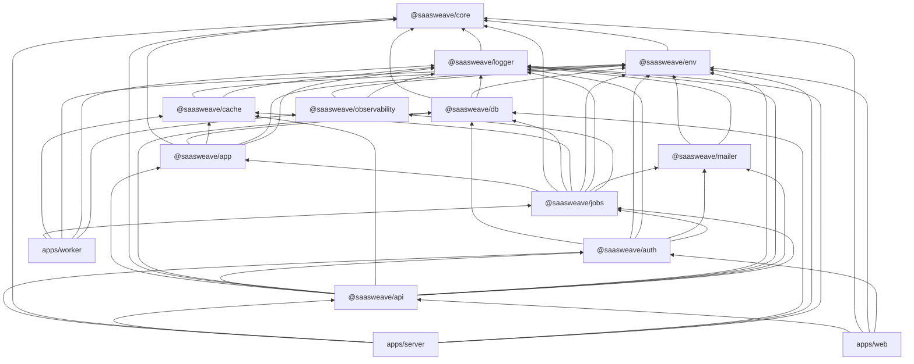

# Package dependency graph

Last updated: 2026-07-11 (Audit Remediation Prompt 8)

This document is the canonical acyclic dependency graph for `@saasweave/*` packages and runnable apps. Arrows read as "depends on".



## Layer responsibilities

| Layer         | Package / app | Owns                                                                                                                                      |
| ------------- | ------------- | ----------------------------------------------------------------------------------------------------------------------------------------- |
| Contracts     | `core`        | Pure domain schemas, constants, formatters                                                                                                |
| Config        | `env`         | Validated environment variables (`server/*`, `web/*` subpaths)                                                                            |
| Persistence   | `db`          | Drizzle schema, queries, migrations                                                                                                       |
| Application   | `app`         | Worker-safe domain services: Stripe webhook apply, exports, batch processing, storage lifecycle, MRR math                                 |
| Transport API | `api`         | oRPC routers, HTTP auth composition, dispatch to queues, browser/server client split                                                      |
| Async         | `jobs`        | Queue contracts, producers, BullMQ processors, orchestration (notifications after export, emails after Stripe)                            |
| Process       | `apps/worker` | Signal lifecycle, readiness HTTP, schedule registration — imports processors only from `jobs`                                             |
| Process       | `apps/server` | Hono HTTP, webhooks, media routes                                                                                                         |
| UI            | `apps/web`    | TanStack Start UI; browser bundles use `@saasweave/api/client/browser/orpc` or the isomorphic `@saasweave/api/client/tanstack-start/orpc` |

## SSR / client boundary

- **Browser bundles** must use `@saasweave/api/client/browser/orpc` (HTTP `RPCLink` + `ENV_WEB_ISOMORPHIC` only) or the isomorphic TanStack Start helper, which dynamically imports the browser client on the client and the server client during SSR.
- **SSR loaders** use the in-process `@saasweave/api/client/server/orpc` via the isomorphic helper. This calls `appRouter` directly with Better Auth session resolution — no extra HTTP hop.
- **Never** import `@saasweave/db`, `@saasweave/env/server/*`, or `@saasweave/auth` from browser-targeted modules.

## Export policy

- `core`, `env`, and `mailer` publish **explicit subpaths** only (no `./*` wildcards).
- Deep imports into `src/` internals are unsupported; consume documented `package.json#exports` entries.
- Boundary checks live in `scripts/__tests__/package-boundaries.test.ts`.

## Validation

```bash
pnpm install
vp check --fix
vp run -w fix
pnpm dotenvx run -f ./packages/env/.env -- vp run -r test:unit
vp run build
pnpm fallow
node scripts/ci/maintainability-gate.mjs
vp test scripts/__tests__/package-boundaries.test.ts
```
