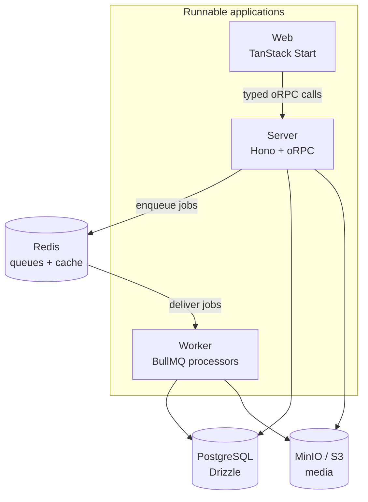
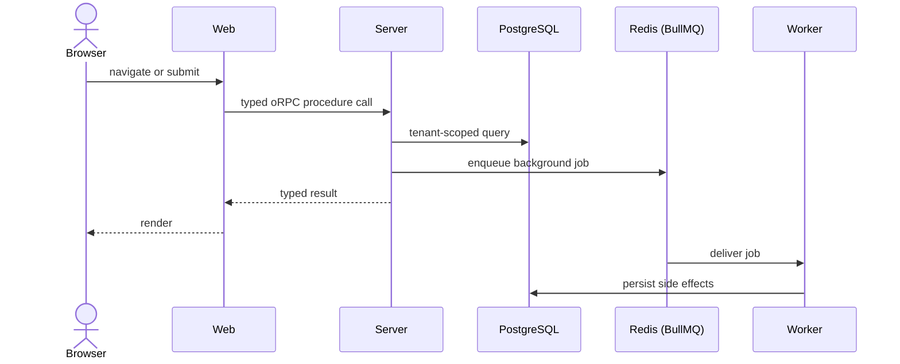

# Architecture

Three runnable applications sit above layered workspace packages.



The web app, the API server, and the worker are separate processes that share
one typed contract and the same data stores. Redis carries both the cache and
the job queues; PostgreSQL is the system of record; MinIO (or any S3-compatible
store) holds media.

## Applications

| Service | Path          | Responsibility                                                  |
| ------- | ------------- | --------------------------------------------------------------- |
| Web     | `apps/web`    | TanStack Start UI: marketing, auth, and the workspace console   |
| Server  | `apps/server` | Hono API, auth handler, Stripe webhooks, and media endpoints    |
| Worker  | `apps/worker` | BullMQ processors: email, notifications, Stripe, webhooks, cron |

## Packages

```text
packages/core          framework-light contracts and security primitives
packages/env           validated server and browser environment schemas
packages/db            schema, migrations and persistence queries
packages/app           worker-safe application services
packages/jobs          queue producers, processors and schedules
packages/auth          Better Auth configuration and policies
packages/api           oRPC procedures and typed clients
packages/cache         Redis cache and rate limiting
packages/logger        structured request and ingestion logging
packages/observability metrics and tracing helpers
packages/mailer        transactional email rendering and delivery
packages/i18n          messages and localized routing helpers
packages/ui            shared UI primitives and theme tokens
packages/seo           route metadata helpers
```

See the [package reference](/reference/packages) for a per-package breakdown.

## Boundaries

Browser modules use the browser or isomorphic oRPC client exports. Database,
server environment, and privileged auth modules stay outside browser bundles.
The dependency direction between packages is enforced, so a browser bundle
cannot pull in server-only code by accident.

The design goal is a single typed boundary: the web app, the API, and the
workers share one end-to-end contract through oRPC, so a change to a procedure's
input or output surfaces as a type error across every consumer rather than a
runtime failure.

A typical request that also does asynchronous work flows like this:



## Deployment shape

Each runnable app has a multi-stage Dockerfile under `apps/*/Dockerfile`. A
production rollout builds immutable web, server, and worker images from the same
commit, runs the server image's `migrator` target once, and then deploys the
three applications with the same validated environment and release identifier.
PostgreSQL and Redis health are required before traffic is accepted.

See [production operations](/guide/operations) for recovery targets, backups,
rollback, retention, metrics, and alerts.
