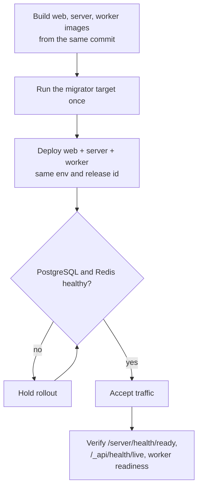

# Production operations

This page summarizes the operational surface. The authoritative runbook is
[PRODUCTION-OPERATIONS.md](https://github.com/mathias7799/SaaSWeave/blob/main/docs/PRODUCTION-OPERATIONS.md),
which covers recovery targets, backups, rollback, retention, metrics, and
incident response in full.

## Deployment sequence



1. Build immutable web, server, and worker images from the same commit.
2. Configure `PLATFORM_ADMIN_EMAILS`, a deliverable `MAIL_PROVIDER`, and a verified `MAIL_FROM`.
3. Configure MinIO credentials and `MINIO_PUBLIC_BASE_URL` when object storage is enabled.
4. Run the server image's `migrator` target once before rolling out application replicas.
5. Deploy web, server, and worker with the same validated environment and release identifier.
6. Require PostgreSQL and Redis health before accepting traffic.
7. Verify `/server/health/ready`, `/_api/health/live`, and the worker readiness endpoint.

[`docker-compose.coolify.yaml`](https://github.com/mathias7799/SaaSWeave/blob/main/docker-compose.coolify.yaml)
provides a hardened Coolify-oriented baseline.

## Testing and quality gates

The repository uses Vitest for package and integration tests and Playwright for
browser flows. CI also enforces formatting, lint and type safety, workspace
builds, package boundaries, coverage, dependency and license policy, secret
scanning, CodeQL, container scanning, Compose validation, a capacity smoke test,
and a PostgreSQL backup/restore drill.

```bash
pnpm run test:unit:run
pnpm --filter @saasweave/api --filter @saasweave/db run test:integration
pnpm --filter @saasweave/web run test:e2e:pw
pnpm run coverage:gate
```

Integration and browser suites require PostgreSQL and Redis. The CI workflow is
the authoritative reference for service configuration.

## Observability

Structured logs, Prometheus metrics behind a bearer token, health and readiness
probes, retention jobs, and a backup verification tool ship with the starter.
Metrics stay off until `METRICS_ENABLED` and `METRICS_BEARER_TOKEN` are set.
